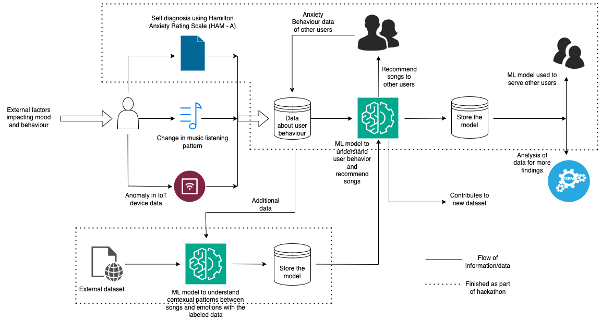

# MoodTunes

## Inspiration
MoodTunes was inspired by a deep understanding of the profound impact music has on emotions and mental well-being. We recognized the need to create a tool that could harness the therapeutic power of music to alleviate anxiety and promote relaxation. We were driven by the idea of making music a key component of mental health and wellness.

## What it does
MoodTunes is an app designed to help individuals manage their anxiety levels through personalized music recommendations. Users input their anxiety levels using the Hamilton Anxiety Rating Scale, and the app utilizes advanced algorithms, including LSTM and NLP, to curate custom playlists that aim to alleviate stress and promote relaxation. It provides a unique blend of music and mental well-being, enhancing the user's overall mood and mental health.

## How we built it
MoodTunes was crafted using Django for the backend, LSTM and NLP for anxiety prediction, Streamlit for the user interface, and Python for seamless integration. We also utilized web automation and data scraping techniques to curate an extensive music library. This combination of technologies enabled us to offer accurate anxiety assessments and personalized music recommendations via a user-friendly app.

Belo is the flow diagram of our work.

### Repository structure

1. `data` folder contains all the dataset that was gathered from websites.
2. `ham_a_app` and `ham_a_project` is the django component for python backend.
3. `src` folder contains code for data preprocessing, classification.
4. `UI` has the code for all the streamlit components.

## Challenges we ran into
Developing algorithms that accurately assessed anxiety levels and recommended suitable music was an ongoing challenge. Additionally, we faced difficulties related to training the transformer model, which impacted our ability to achieve the desired level of accuracy in assessing anxiety levels and making music recommendations. Overcoming these challenges required innovative solutions and continuous efforts to refine the app.

## Accomplishments that we're proud of
Successfully launching an app that harnesses the therapeutic power of music to support mental well-being. Creating a vast music library and a robust algorithm that delivers personalized music recommendations.

## What we learned
During the development of MoodTunes, we learned about the complexities of music psychology and intricate algorithm development. We also gained insights into user engagement and the importance of continually refining and improving the user experience.

## What's next for MoodTunes
Expand the app's music library to provide an even wider range of music choices for users.
Continue refining and enhancing the algorithm to improve the accuracy of anxiety assessments and music recommendations.
Explore partnerships with mental health professionals and institutions to integrate MoodTunes into therapy and wellness programs.
